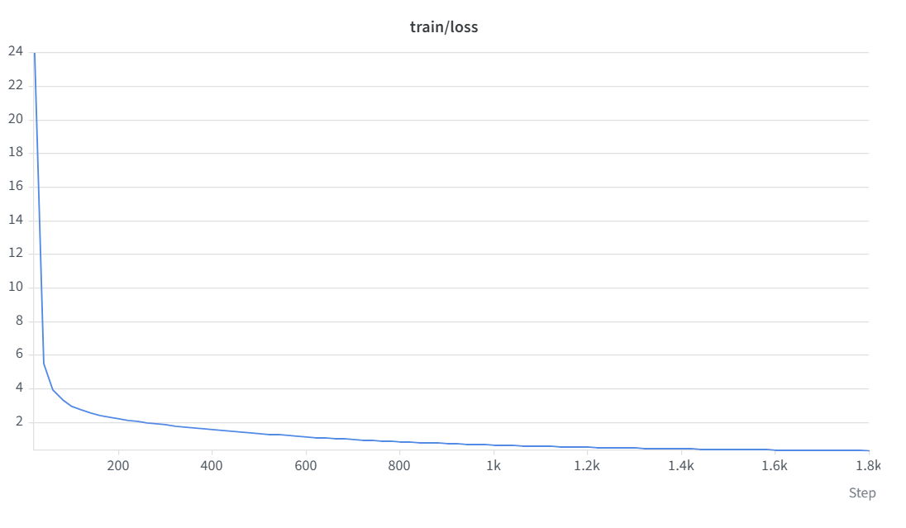
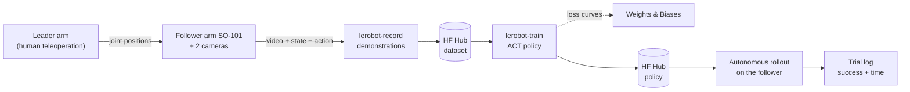

# Imitation Learning for Robot Manipulation: ACT Policy on SO-101 Arms

I assembled and calibrated a leader-follower pair of **SO-101** robot arms from a kit, teleoperated them to record 30 demonstrations of picking up a cube and placing it in a bowl, published the dataset on the Hugging Face Hub, trained an **ACT** (Action Chunking with Transformers) policy with [LeRobot](https://github.com/huggingface/lerobot), and evaluated it autonomously on the real robot: **5/5 successful trials, 9.92 s on average**.

Done during the HKUST USEL robot-arm imitation learning workshop. This repository documents my part of the pipeline (hardware assembly, data collection, training, evaluation, analysis) with thin wrapper scripts around LeRobot's CLI. It does **not** reimplement LeRobot or ACT.

## Demo

[Watch the autonomous rollout](https://drive.google.com/file/d/1TTOTJDaSrRHapPnlfKs2FnhNE25wNREs/view) (Google Drive): the trained policy picks up the pink cube and places it in the yellow bowl with no human control.

## Results

| Item | Value |
|---|---|
| Demonstrations | 30 teleoperated episodes, 20,436 frames at 30 fps (about 22.7 s per episode on average) |
| Policy | ACT, LeRobot implementation (learning rate 1e-5; loss = L1 + 10 x KL) |
| Training | 1,800 steps (about 19.7 epochs), 224 samples per step |
| Training compute | About 33 min (2,001 s, 1.07 s per step); GPU with about 88 GB of memory in use |
| Training loss | 24 (first logged step, read from the W&B chart) to **0.329** at step 1,800, a drop of over 98% (final L1 0.211, KL 0.012) |
| Autonomous success (cube in bowl) | **5/5 trials** |
| Autonomous completion time | **9.92 s average** (best 9.34 s, worst 10.67 s; stopwatch) |
| Evaluation conditions | Same cube and bowl positions as in the demonstrations; same lighting and white background |
| Observed failures | None in the 5 trials |

Completion time of each successful trial (stopwatch):

| Trial | 1 | 2 | 3 | 4 | 5 |
|---|---|---|---|---|---|
| Time (s) | 9.34 | 9.52 | 9.88 | 10.21 | 10.67 |

Links
- Hugging Face (dataset and policy): [sagnikroy75](https://huggingface.co/sagnikroy75)
- Weights & Biases run (may require a login): [lerobot / dqj2t9lb](https://forge.coreweave.com/wandb/sroyaa-hong-kong-university-of-science-and-technology/lerobot/runs/dqj2t9lb)
- Demo video: [Google Drive](https://drive.google.com/file/d/1TTOTJDaSrRHapPnlfKs2FnhNE25wNREs/view)

Training loss from the W&B run:



## Pipeline



## Hardware

Full details and per-part table: [docs/hardware_build.md](docs/hardware_build.md). Specs are the standard SO-101 bill of materials.

| | |
|---|---|
| Robot | Two 6-DoF SO-101 arms assembled from a kit: a leader moved by hand and a follower that mirrors it |
| Actuators | 12 Feetech STS3215 serial bus servos (6 per arm), absolute 12-bit magnetic encoders. Leader: 7.4 V servos (1:345 / 1:191 / 1:147 gearing, easy to back-drive). Follower: 12 V servos, 1:345 on all joints |
| Control electronics | 2x Waveshare bus servo adapters (USB to TTL), one per arm, each on its own bus. No separate microcontroller between the arms: the host computer relays leader to follower |
| Power | Leader: 5 V 4 A supply (deliberately underpowers the 7.4 V servos so they back-drive by hand). Follower: 12 V 2-5 A supply |
| Structure | 3D-printed frame from the kit, M2/M3 screws and nuts, 2x MF106ZZ gripper bearings, 4 desk C-clamps |
| Cameras | Two Intel RealSense cameras (D435i and D455), RGB video at 30 fps: `top` (overhead, 640 x 480) and `wrist.left` (wrist-mounted, recorded 480 wide x 640 high) |
| Host | Windows PC set up with the workshop guide; Python 3.12 in a conda environment |
| Scene | Pink 7 x 7 cm cube, yellow bowl of 10 cm radius, white background, clear lighting |

## Software

| | |
|---|---|
| Environment | Miniconda/Miniforge, Python 3.12, ffmpeg (conda-forge) |
| ML | PyTorch with CUDA (workshop guide: torch 2.11.0, torchvision 0.26.0, cu128) |
| Robot learning | LeRobot (dataset format v3.0), `scservo_sdk` for the Feetech servos |
| Tooling | Hugging Face CLI (`hf`), Weights & Biases |

## Setup

Complete step-by-step guide (Windows): [docs/setup_windows.md](docs/setup_windows.md). In short:

1. Install Miniconda or Miniforge; create and activate the `lerobot` environment (Python 3.12).
2. Install ffmpeg, PyTorch (NVIDIA GPU only) and LeRobot (`lerobot`, `lerobot[core_scripts,training]`, `lerobot[feetech]`).
3. Log in to Hugging Face (`hf auth login`) and, optionally, Weights & Biases (`wandb login`).
4. Find ports and cameras (`lerobot-find-port`, `lerobot-find-cameras`) and calibrate each arm with `lerobot-calibrate`.
5. Smoke-test teleoperation with `lerobot-teleoperate` before recording.

## Quick start

```powershell
# Anaconda PowerShell Prompt, after following docs/setup_windows.md
conda activate lerobot
lerobot-calibrate --robot.type=so101_follower --robot.port=COM3 --robot.id=my_follower_arm   # once per arm
lerobot-calibrate --teleop.type=so101_leader  --teleop.port=COM4 --teleop.id=my_leader_arm
Copy-Item config\default.ps1 config\local.ps1     # set ports, camera indices and arm IDs
.\scripts\record_cube_bowl.ps1                    # 1. record demonstrations, push dataset to the Hub
.\scripts\train_act.ps1                           # 2. train ACT, log to W&B
.\scripts\eval_act.ps1                            # 3. autonomous rollouts, log outcome and time per trial
python analysis\plot_actions.py --repo-id sagnikroy75/so101_cube_bowl   # use your dataset repo id
python analysis\summarize_trials.py
```

Bash equivalents (Git Bash / WSL / Linux / macOS): `scripts/*.sh` with `config/default.env` copied to `config/local.env`.

The cameras' names, count and frame shapes must be identical in recording and evaluation: the policy was trained on `observation.images.top` and `observation.images.wrist.left`. The wrappers read the camera settings from `CAMERA_CONFIG` in the config file; set the camera type, indices or serial numbers there to match your hardware.

## Repository structure

```
.
├── README.md
├── LICENSE
├── assets/                  # wandb_loss.png (training loss); see assets/README.md for optional additions
├── config/                  # default.env / default.ps1 (copy to local.* and edit)
├── scripts/                 # record_cube_bowl, train_act, eval_act (.sh and .ps1)
├── analysis/
│   ├── plot_actions.py      # trajectory + action-vs-state plots, dataset summary
│   ├── summarize_trials.py  # success count, 95% interval, completion-time stats
│   └── requirements.txt
├── results/
│   └── eval_trials.csv      # one row per autonomous trial (outcome, time_s)
└── docs/
    ├── hardware_build.md
    ├── setup_windows.md
    ├── data_collection_protocol.md
    └── dataset_card.md      # body for the Hugging Face dataset README
```

## My contribution

- Assembled the leader and follower SO-101 arms from a kit, set up two cameras, and calibrated both arms with `lerobot-calibrate`.
- Teleoperated the leader arm so the follower picked up a cube and placed it in a bowl, and recorded 30 demonstrations (two camera streams, robot states, actions).
- Created the dataset and uploaded it to the Hugging Face Hub.
- Trained an ACT policy on it with LeRobot and monitored training in Weights & Biases.
- Evaluated the policy on the physical robot: 5/5 successful autonomous trials, 9.92 s average completion time (best 9.34 s).
- Wrote this repository after the workshop: configuration-driven wrapper scripts, trial logging, analysis scripts, dataset card and documentation.


**Note on the scripts**
- The wrapper scripts generalise the commands from the LeRobot documentation. LeRobot's CLI flags change between releases; see the note at the bottom of [docs/setup_windows.md](docs/setup_windows.md).

## Limitations
- Small dataset from one operator in one scene.
- The cube and bowl started in the same fixed positions in every demonstration and in every evaluation trial, so the results do not show generalisation to other positions, lighting or objects.
- Five evaluation trials give a wide confidence interval; `analysis/summarize_trials.py` prints it.

## Acknowledgements
- [Hugging Face LeRobot](https://github.com/huggingface/lerobot) (Apache-2.0) for the robot-learning library, SO-101 support and the ACT implementation.
- ACT: Zhao, Kumar, Levine, Finn, *Learning Fine-Grained Bimanual Manipulation with Low-Cost Hardware*, RSS 2023 ([arXiv:2304.13705](https://arxiv.org/abs/2304.13705)).
- SO-101 arm design: [TheRobotStudio SO-ARM100](https://github.com/TheRobotStudio/SO-ARM100).
- HKUST USEL workshop organizers and instructors for the hardware, the Windows environment guide and the teaching.

## License
Scripts and docs in this repository: MIT (see [LICENSE](LICENSE)). LeRobot is Apache-2.0.
